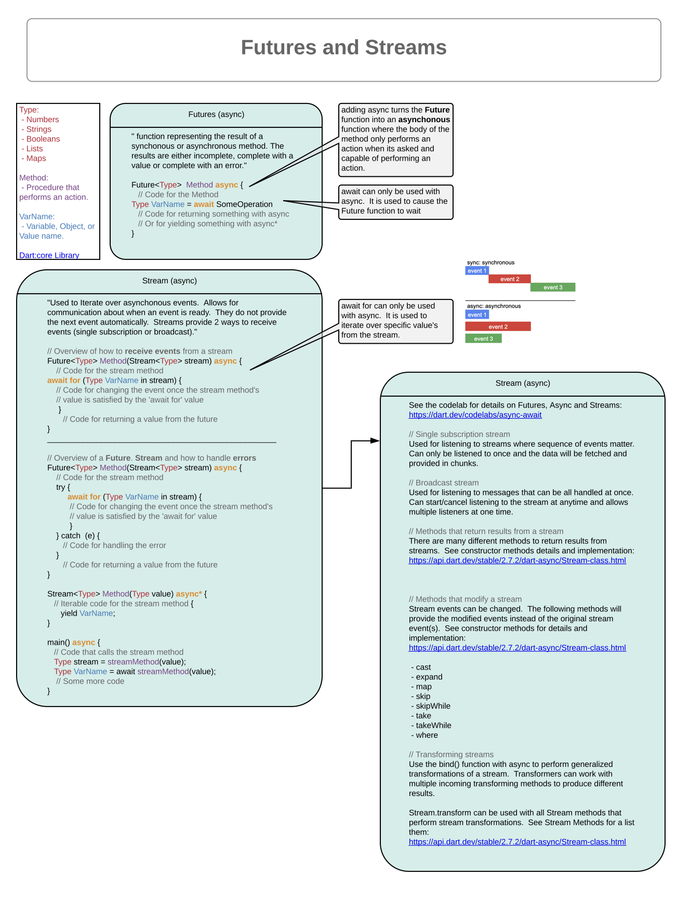
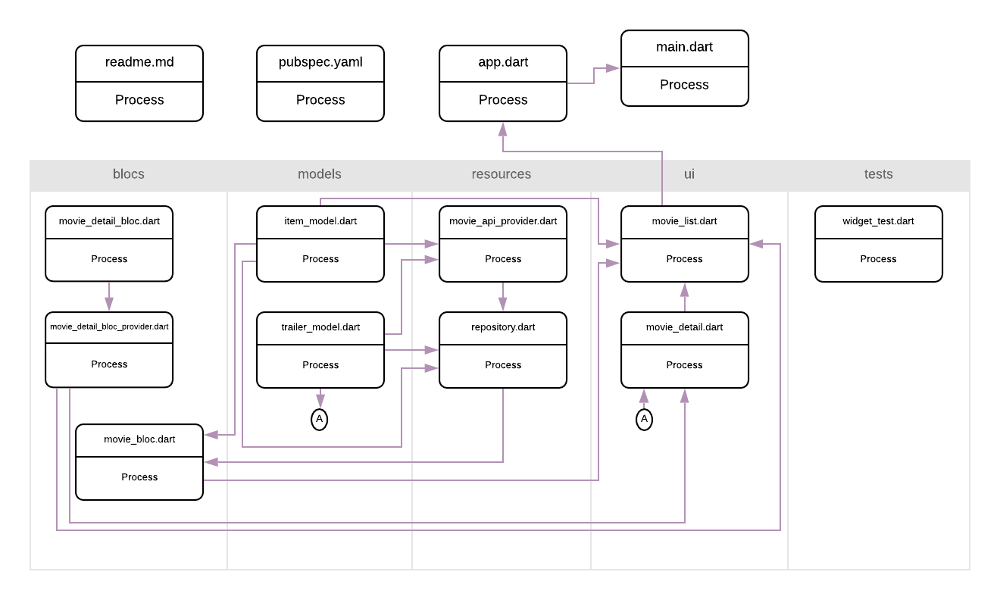

# Movies

Movie app project written in Dart using BloC pattern, API calls, a repository, and testing.

# Demo

# BloC Architecture

High-level representation of the futures and streams architecture.

Reference links:
- [Dart:core Library](https://api.dart.dev/stable/2.7.2/dart-core/dart-core-library.html)
- [https://dart.dev/codelabs/async-await](https://dart.dev/codelabs/async-await)
- [https://api.dart.dev/stable/2.7.2/dart-async/Stream-class.html](https://api.dart.dev/stable/2.7.2/dart-async/Stream-class.html)

High-level representation of the app:

## Getting Started

This project is a starting point for a Flutter application.

A few resources to get you started if this is your first Flutter project:

- [Medium Article: Architect flutter project using bloc pattern part 2](https://medium.com/flutterpub/architect-your-flutter-project-using-bloc-pattern-part-2-d8dd1eca9ba5)
- [Lab: Write your first Flutter app](https://flutter.dev/docs/get-started/codelab)
- [Cookbook: Useful Flutter samples](https://flutter.dev/docs/cookbook)

For help getting started with Flutter, view our
[online documentation](https://flutter.dev/docs), which offers tutorials,
samples, guidance on mobile development, and a full API reference.
